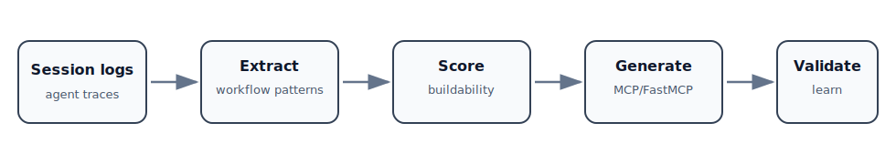

# spawn

> Analyze AI agent logs, extract reusable workflow patterns, and generate production-ready MCP/FastMCP servers.

**Tagline:** The MCP server that builds MCP servers.

[](https://opensource.org/licenses/MIT)


---

## 30-second demo

Input: an AI agent session log with repeated workflows.

spawn can:

1. parse the log,
2. extract recurring workflow patterns,
3. score which ones are worth automating,
4. generate a complete MCP/FastMCP server,
5. validate the generated structure,
6. learn from build outcomes.

Result: a reusable MCP server instead of a useful pattern trapped in chat history.



## Before -> after

### Before

A repeated agent workflow lives only in a session transcript:

```text
Read issue text -> classify issue -> create checklist -> write report
```

### After

spawn turns that pattern into a reusable MCP/FastMCP server with:

- tools,
- tests,
- `pyproject.toml`,
- README,
- MCP metadata.

See [`examples/generated-mcp/`](examples/generated-mcp/) for a compact generated-output sample.

## Who this is for

spawn is for people building AI agent systems, MCP ecosystems, internal automation, or repeatable tool workflows from messy real-world agent sessions.

It is especially useful when a workflow keeps appearing in agent traces and deserves to become an explicit, testable tool boundary.

## What spawn is not

spawn is not a general-purpose coding agent.

It does not replace semantic judgment from the calling AI. It provides the MCP tools, scoring, templates, validation, and memory hooks needed to turn recurring agent workflows into reusable servers.

## What is spawn?

spawn is a meta-MCP server that analyzes patterns in AI agent session logs, scores them for buildability, and generates complete MCP server implementations from those patterns.

It closes the loop: your AI agent discovers a useful workflow -> spawn extracts the pattern -> spawn generates a working MCP server that codifies it.

**Design Principle:** AI-agnostic. spawn provides data and utilities. The calling AI (any MCP-compatible model) provides semantic understanding. No vendor lock-in.

## Why it matters

Every AI agent session produces patterns: recurring tool sequences, multi-step workflows, domain-specific conventions. These patterns are valuable but ephemeral - they exist only in session logs and memory.

spawn makes them permanent. It:
- Extracts recurring patterns from session logs
- Scores them for automation potential
- Generates production-ready MCP servers from scored patterns
- Learns from build outcomes to improve future scoring

## How it works

```
Session logs / transcripts
        |
        v
  PARSE (log_parser)
  Extract tool calls, AI actions, user requests
        |
        v
  EXTRACT (pattern_extractor)
  Identify recurring sequences and themes
        |
        v
  SCORE (scoring_engine)
  Rate patterns for buildability (frequency, complexity, feasibility)
        |
        v
  GENERATE (generator_engine)
  Produce complete MCP server: server.py, tools, tests, pyproject.toml
        |
        v
  VALIDATE (validator)
  Verify generated code structure and imports
        |
        v
  LEARN (learning_engine)
  Record outcomes, refine scoring weights
```

## 17 MCP Tools

### Primary Tools (AI-driven workflow)

| Tool | What it does |
|------|-------------|
| `get_log_content` | Parse a session log, return structured data for AI analysis |
| `find_recurring_themes` | Frequency analysis to surface potential patterns |
| `define_pattern` | AI defines a pattern it identified from the content |
| `score_patterns` | Score patterns for buildability (0-100) |
| `generate_preview` | Preview generated code before committing |
| `generate_mcp` | Generate a complete MCP server from a scored pattern |
| `validate_mcp` | Validate the generated server structure |

### Library Tools

| Tool | What it does |
|------|-------------|
| `list_patterns` | List all defined patterns in the session |
| `get_pattern` | Get details for a single pattern |
| `store_pattern` | Save a pattern to the persistent library |
| `search_patterns` | Search the pattern library by keyword or tag |
| `suggest_similar` | Find similar existing patterns |
| `learn_outcome` | Record build success/failure for scoring refinement |

### Pipeline Tools

| Tool | What it does |
|------|-------------|
| `run_pipeline` | Full end-to-end: analyze -> score -> generate |
| `compare_existing` | Compare a pattern against existing MCP servers |
| `batch_analyze` | Process multiple log files in batch |

## Quick Start

```bash
# Install
pip install -e ".[dev]"

# Run as MCP server
python -m mcp_builder_mcp.server

# Add to .mcp.json
{
  "spawn": {
    "command": "bash",
    "args": ["-c", "cd /path/to/spawn && .venv/bin/python -m mcp_builder_mcp.server"]
  }
}
```

## Example Usage

```
User: "Analyze my last session log for patterns"
AI: calls get_log_content with the log file
AI: calls find_recurring_themes to identify candidates
AI: calls define_pattern for each promising pattern
AI: calls score_patterns to rank them
AI: calls generate_mcp for the top-scoring pattern
-> Complete MCP server generated: server.py, tests, pyproject.toml, README
```

## Architecture

```
spawn/
├── src/mcp_builder_mcp/
│   ├── server.py              # FastMCP server (17 tools)
│   ├── parser/                # Log parsing (multi-format)
│   │   └── log_parser.py
│   ├── extractor/             # Pattern extraction
│   │   └── pattern_extractor.py
│   ├── scorer/                # Buildability scoring
│   │   └── scoring_engine.py
│   ├── generator/             # Code generation
│   │   ├── generator_engine.py
│   │   ├── validator.py
│   │   └── templates/         # Jinja2 templates for generated code
│   ├── store/                 # Persistence
│   │   ├── pattern_store.py   # JSON-backed pattern library
│   │   ├── learning.py        # Outcome tracking + weight refinement
│   │   └── minna_sync.py      # Optional memory integration
│   └── models/                # Data models
│       ├── pattern.py
│       └── score.py
└── tests/                     # 156 tests (unit + integration + e2e)
```

## Scoring Model

Patterns are scored on 5 dimensions (configurable weights):

| Dimension | Default Weight | What it measures |
|-----------|---------------|-----------------|
| Frequency | 0.3 | How often the pattern appears |
| Complexity | 0.2 | Complex enough to justify automation? |
| Feasibility | 0.2 | Implementable as an MCP server? |
| Impact | 0.2 | Value of automating this pattern |
| Novelty | 0.1 | Already served by existing tools? |

## Generated Output

For each pattern, spawn generates:

- `server.py` - Complete FastMCP server with tool implementations
- `pyproject.toml` - Build configuration
- `tests/test_*.py` - Test scaffolding
- `README.md` - Documentation
- `MCP_INFO.md` - MCP metadata

All generated code uses Jinja2 templates (customizable in `generator/templates/`).

For a compact illustration of the generated-output contract, see [`examples/generated-mcp/`](examples/generated-mcp/).

## Testing

```bash
python -m pytest tests/ -v          # All 156 tests
python -m pytest tests/unit/ -v     # Unit tests
python -m pytest tests/integration/ -v
python -m pytest tests/e2e/ -v
```

## Showcase

See the [spawn showcase site](https://fbratten.github.io/spawn-showcase/) for demos and documentation.

## License

MIT